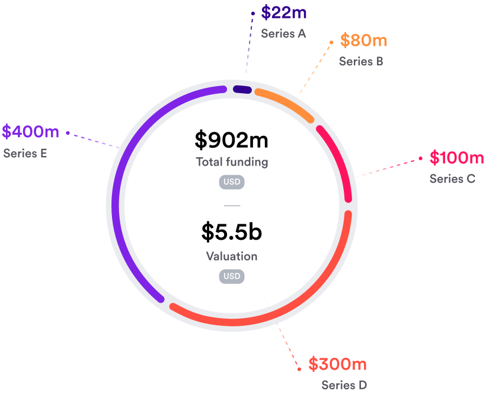
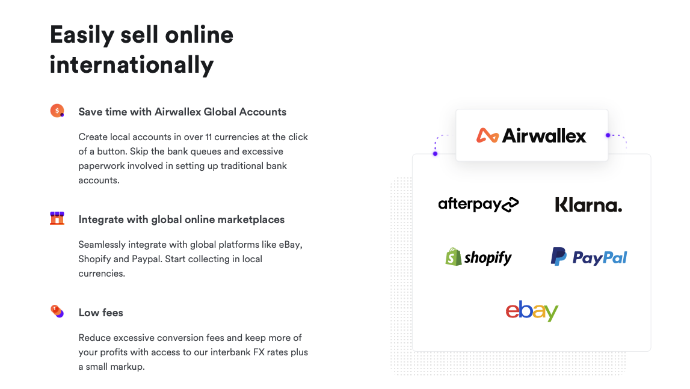
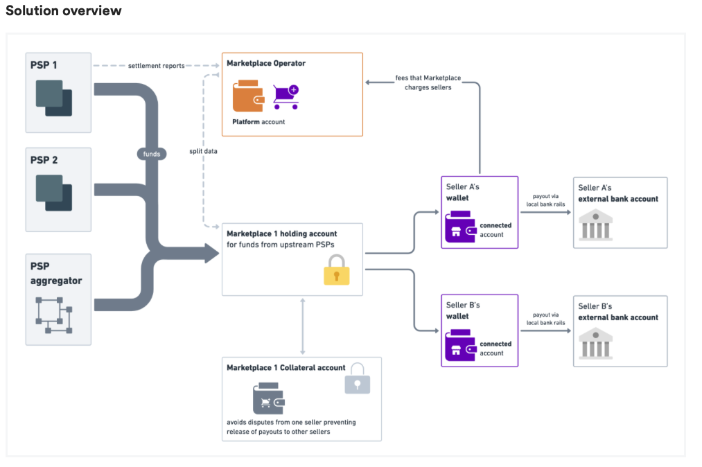

What is the background of your company? What do they do? Who are their competitors?

How does this company use technology to their advantage? Why are they considered a FinTech company?

Why is this company exemplary in the FinTech space? What are their strengths and weaknesses?

What is the prognosis for this company? Where do they expect to be in the future?

---
# Airwallex: The next Australian Unicorn?

*Author: Shayan Shahnia*, *16-Mar-2022*

## Overview and Origin

* Name of company

**Airwallex**1

* When was the company incorporated?

Airwallex is a start up with ambitions to go public and was founded in Melbourne in 2015.2

* Who are the founders of the company?

Jack Zhang, Max Li, Lucy Liu, Xijing Dai

[About Airwallex](https://www.airwallex.com/au/who-we-are)

* How did the idea for the company (or project) come about?

Airwallex was established when the founders recognised the heavy impact of FX fees and other banking costs on their small business's profits. This motivated them to work on a better approach to enable businesses to operate internationally beyond the limitations of the current global financial system.

* How is the company funded? How much funding have they received?

Having gained the backing of major investors, Airwallex has received multiple rounds of funding through to series E for a total of $902m USD.

## Business Activities:

* What specific financial problem is the company or project trying to solve?

Airwallex is a global payment platform that offers solutions to SMB (small medium business). including business accounts, company cards, internationall transfer and collections, and APIs for embedded financial services. The company's direction was inspired by the challenges faced by two of its founders when their SMB business began facing increasing fees and complicated processes to conduct business internationally.

>“As small business owners, we quickly saw the pain points with global payments and the impact of high FX fees and banking costs when sourcing for supplies,” said Jack Zhang, Co-founder and CEO of Airwallex. “We wanted to build out a better financial and payment solution for businesses operating across borders, and ensure they are empowered to grow.”

* Who is the company's intended customer?  Is there any information about the market size of this set of customers?

The primary customer base of Airwallex, are SMB business that require and innovative payment solution for local and international transactions. Since it's founding Airwallex is now offering embedded API soltions for larger enterprises as well.

As such, the customer base of Airwallex have the below characteristics:3, 4

1. **Small Businesses:**

- *Employee Size:* 1-19
- *Turnover:* Up to $10m AUD

2. **Medium Businesses:**

- *Employee Size:* 20-199
- *Turnover:* $10m-$249m AUD

3. **Enterprise Businesses:**

- *Employee Size:* 200+
- *Turnover:* $250m+ AUD

* What solution does this company offer that their competitors do not or cannot offer? (What is the unfair advantage they utilize?)

Airwallex is making setting up business accounts and trasacting internationally very simple and quick. Customers can trade globally in any of the currently 11 offered currencies, and integrate the payment solution with online marketplaces as well. Another feature is easy integration with Xero which aims to make "bookkeeping a breeze".

The company has designed it's products and services to be tailored made for SMB business, offering products that those businesses need to run a successful international business whilst offering a fee structure that scales with the customers needs.

* Which technologies are they currently using, and how are they implementing them? (This may take a little bit of sleuthing–– you may want to search the company’s engineering blog or use sites like Stackshare to find this information.)

Airwallex is using 40+ technology solutions and services including HTML5, Google Analytics, and Google Fonts. 5 Additioanlly, Airwallex offers API integrations 6 and embedded finance, and PSP-agnostic solution.

## Landscape:

* What domain of the financial industry is the company in?

Payments, billing, open banking and enterprise solutions

* What have been the major trends and innovations of this domain over the last 5-10 years?

A move to wholistic offerings of products and solutions, fully online with clear fee structures and intergration capabilities to multiple tools within domains such as tax and accounting, online market places and CRM systems.

* What are the other major companies in this domain?

Major competitors in this domain include:
- WildApricot Payments
- Stripe
- Apple Pay
- Dwolla
- Due
- Square
- PayPal
- Birdeye
- Amazon Pay

Major banks have also been entering this space:
- Westpac
- NAB
- CBA

## Results

* What has been the business impact of this company so far?

Airwallex has seen Rapid growth over the past 8 years with an increasing customer base and a valuation of $5b+ USD.

* What are some of the core metrics that companies in this domain use to measure success? How is your company performing, based on these metrics?

Airwallex has been growing its customer base and number of trasction it supports rapidly. As a company in the payment solutions space, a key metric here the number of transaction processed and according to Airwallex they have grown this metric by 5x over 2021-2022. Other metrics include the cost and time invovled with processing payments and as a, currently, privately owned company these metrics are harder to come by.

* How is your company performing relative to competitors in the same domain?

Airwallex is new than some of its major competitors in market. It has een growing at a rapid base and increasing its internationall presence.8 Being newer in market has meant Airwallex is yet to offer the more extensive list of currencies offered by sme of its competitors and there is no product offering to individuals as of yet.9
 
## Recommendations

* If you were to advise the company, what products or services would you suggest they offer? (This could be something that a competitor offers, or use your imagination!)

Given the domain Airwallex operates in, a vertically integrated solution could be the way to go for the company. This includes acquiring or developing their own marketplace solution and accounting solutions for their clients. Being a unicorn startup company Airwallex is at the forefront of technological developments already, however, it is yet to use blockchain technology for its product offerings and this could be another technological development for the company.

* Why do you think that offering this product or service would benefit the company?

The offerings above would remove additional costs of integrating with third party solutions and provide the company control over the full end to end product experience. Additionally, through leveraging blockchain, the company could further enhance its security and more easily track payments.

* What technologies would this additional product or service utilize?

Since Airwallex has an extensive API offering, integrating into additional online payment solutions and marketplaces should be an easier undertaking. These additional techonologies could utilise machine learning algorimths to determine payment behaviours and help the company decide the next currency to unlock for its customers.

* Why are these technologies appropriate for your solution?

---
# Terms
SMB
: Small to Medium Business

# References

1. [AirWallex](https://www.airwallex.com/au/who-we-are)

2. [TechCrunch](https://www.google.com/url?sa=t&rct=j&q=&esrc=s&source=web&cd=&cad=rja&uact=8&ved=2ahUKEwiriKKbgeT9AhUYR2wGHfRWCF4QFnoECC0QAQ&url=https%3A%2F%2Ftechcrunch.com%2Fsponsor%2Fairwallex%2Faustralian-fintech-airwallex-enters-us-market-us200m-series-e-fundraising-round-lifts-valuation-to-4bn%2F&usg=AOvVaw2td-BxaTDdFHXF4ogD6KZm)

3. [Australian_Bureau_of_Statistics](https://www.abs.gov.au/statistics/economy/business-indicators/counts-australian-businesses-including-entries-and-exits/latest-release#employment-size)

4. [Australian_Taxation_Office](https://www.ato.gov.au/business/)

5. [Crunchbase](https://www.crunchbase.com/organization/airwallex/technology)

6. [Airwallex_API](https://www.airwallex.com/docs/api#/Getting_Started)

7. [WildApricot](https://www.wildapricot.com/blog/online-payment-services)

8. [CBINSIGHTS](https://www.cbinsights.com/company/airwallex/alternatives-competitors)

9. [Statrys](https://statrys.com/blog/airwallex/airwallex-review)
